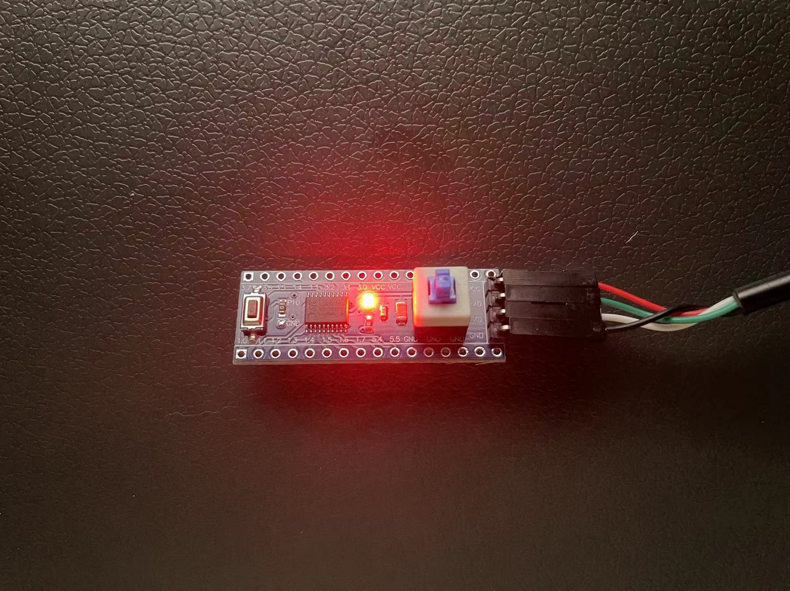

STC15W408AS Example
===================

Setup
=====

    pip install platformio

Hardware
========

1. STC15W408AS Development Board
2. USB to Serial Port Connector (Green: TX, White: RX)

Build
=====

1. Turn off the latch switch
2. make
3. When see 'Cycling power: done', press the latch switch
